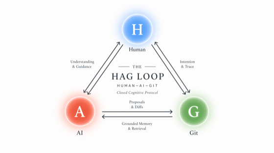

# Henry Zhang  &nbsp;·&nbsp;  *CyberWizard*

Independent researcher &nbsp;·&nbsp; Hangzhou &nbsp;·&nbsp; currently at <a href="https://modelbest.cn">ModelBest / MiniCPM</a>

<h3>One person. Six modalities. Five layers.</h3>

<em>Theory &rarr; Tools &rarr; Runtime &rarr; Product &rarr; Culture.</em> 
Full-Stack, All Runnable.

<!-- identity badges -->

<!-- domains covered -->

---

## How it gets built

<table align="center"><tr>
<td valign="middle" align="center" width="340">

</td>
<td valign="middle" width="500">
<b>H</b> &mdash; asks, doesn&rsquo;t stop at the first plausible answer. 
<b>A</b> &mdash; pattern-completes, surfaces adjacencies. 
<b>G</b> &mdash; append-only memory; rollback when a branch is wrong.
  
<em>The matrix below isn&rsquo;t a persona. It&rsquo;s what this loop outputs when it runs continuously.</em>
</td>
</tr></table>

---

## The Matrix

*What I actually ship, across every layer of the stack &mdash; in the open where I can, on commercial deployments where I can&rsquo;t.*

<table>
<thead>
<tr>
  <th align="left">&nbsp;</th>
  <th align="left">Science</th>
  <th align="left">Open-source Tools</th>
  <th align="left">Runtime / Models</th>
  <th align="left">Products / Deploy</th>
  <th align="left">Content / IP</th>
</tr>
</thead>
<tbody>

<!-- Row 1 : LLM / Text -->
<tr>
<td valign="top"><b>LLM/Text</b></td>
<td valign="top">
&bull; <a href="https://doi.org/10.5281/zenodo.19626829"><b>TRB</b></a> P1 &middot; Rep.Bandwidth 
&bull; <a href="https://doi.org/10.5281/zenodo.19587024"><b>SFP&nbsp;v2</b></a> P2 &middot; probe kit 
&bull; <a href="https://github.com/HenryZ838978/rl-drift">rl-drift</a>
</td>
<td valign="top">
&bull; <a href="https://github.com/HenryZ838978/spectral-flow-probe"><b>spectral-flow-probe</b></a> &middot; 20-min RL scan 
&bull; <a href="https://github.com/HenryZ838978/turboquant-pytorch">turboquant-pytorch</a> &middot; ICLR'26 
&bull; <a href="https://github.com/HenryZ838978/RepEngvLLM">RepEngvLLM</a>
</td>
<td valign="top">
&bull; <a href="https://github.com/HenryZ838978/nano-vllm-with-TurboQuant">nano-vllm+TQ</a> &middot; 5&times;&nbsp;KV 
&bull; <a href="https://github.com/HenryZ838978/flash-attn-blackwell">flash-attn-blackwell</a> &middot; sm_120
</td>
<td valign="top">
&bull; <a href="https://github.com/HenryZ838978/claude-code">claude-code</a> fork 
&bull; open-code-agent
</td>
<td valign="top">
&bull; <a href="https://github.com/HenryZ838978/superpowers-cn">superpowers-cn</a> 
&nbsp;&nbsp;10&#8239;k&#x2B50; &middot; CN
</td>
</tr>

<!-- Row 2 : Vision / VLA -->
<tr>
<td valign="top"><b>Vision/VLA</b></td>
<td valign="top">
&bull; <a href="https://github.com/HenryZ838978/RepSNI">RepSNI</a> &middot; 14&#8239;mdls, SNI 
&bull; TRB &sect;VLA &middot; geometry
</td>
<td valign="top">
&bull; <a href="https://github.com/HenryZ838978/SDE">SDE</a> &middot; DarkSpace 
&bull; <a href="https://github.com/HenryZ838978/Joi">Joi</a> &middot; drift engine
</td>
<td valign="top">
&bull; minicpmv_onnx 
&bull; multi-image async VLM (QNN)
</td>
<td valign="top">
&bull; <b>AVIA &mdash; Satellite VLM</b> 
&nbsp;&nbsp;libtorch C++ &middot; on-board
</td>
<td valign="top">
&bull; <a href="https://github.com/HenryZ838978/Seedance2.0-Storyboard-Planner"><b>Seedance 2.0 Planner</b></a> 
&nbsp;&nbsp;44&#x2B50; &middot; ByteDance video
</td>
</tr>

<!-- Row 3 : Speech / Audio -->
<tr>
<td valign="top"><b>Speech/Audio</b></td>
<td valign="top">&mdash;</td>
<td valign="top">
&bull; dereverb_audio &middot; DSP
</td>
<td valign="top">
&bull; VoxCPM &middot; voice-clone 
&bull; Omni &middot; MiniCPM-o 4.5 gguf
</td>
<td valign="top">
&bull; <b>AVIA &mdash; ATC ASR</b> &middot; Apple Silicon 
&nbsp;&nbsp;<b>RTF&nbsp;&gt;&nbsp;3</b> &middot; <b>mem&nbsp;&lt;&nbsp;2&#8239;GB</b> 
&bull; <a href="https://github.com/HenryZ838978/CallCenter-VoiceAgent">CallCenter-VA</a> &middot; <a href="https://github.com/HenryZ838978/Hybrid-VoiceAgent">Hybrid-VA</a> 
&bull; <a href="https://github.com/HenryZ838978/Voiceagent-MacApp">Voiceagent-Mac</a>
</td>
<td valign="top">
&bull; <b>PixelSynesthesia</b> &middot; music&rarr;pixel 
&bull; <a href="https://www.bilibili.com/video/BV1U42wBvEFz"><b>&laquo;&#26538;&#20853;&#39042;&raquo; AI MV</b></a> &middot; 100&#8239;k &middot; 7.1&#8239;k
</td>
</tr>

<!-- Row 4 : Edge / Hardware -->
<tr>
<td valign="top"><b>Edge/Hardware</b></td>
<td valign="top">
&bull; MiniCPM cross-platform bench
</td>
<td valign="top">&mdash;</td>
<td valign="top">
&bull; QNN &middot; MTK &middot; RKNN 
&bull; Intel NPU &middot; Apple Silicon
</td>
<td valign="top">
&bull; <a href="https://github.com/HenryZ838978/ScalEdgeClaw">EdgeClaw-audit</a> 
&nbsp;&nbsp;multi-tenant isolation
</td>
<td valign="top">&mdash;</td>
</tr>

<!-- Row 5 : Agent / Workflow -->
<tr>
<td valign="top"><b>Agent/Workflow</b></td>
<td valign="top">
&bull; <b>HAG Loop</b> &middot; H&ndash;AI&ndash;Git
</td>
<td valign="top">
&bull; <a href="https://github.com/HenryZ838978/ScalEdgeClaw">ScalEdgeClaw</a>
</td>
<td valign="top">
&bull; cursor-rts-audio
</td>
<td valign="top">
&bull; <a href="https://github.com/HenryZ838978/pocketclaw"><b>PocketClaw</b></a> APK 
&nbsp;&nbsp;20&#x2B50; &middot; 19.4&#8239;k Kotlin &middot; no server 
&bull; OmniAgent &middot; Swift
</td>
<td valign="top">
&bull; <a href="https://github.com/HenryZ838978/OpenMAIC-VoiceSupport"><b>OpenMAIC</b></a> 
&nbsp;&nbsp;THU MAIC &middot; voice
</td>
</tr>

<!-- Row 6 : Meta / Tooling -->
<tr>
<td valign="top"><b>Meta/Tooling</b></td>
<td valign="top">&mdash;</td>
<td valign="top">
&bull; <b><a href="https://www.npmjs.com/package/pgattn">pgattn</a></b> &middot; LM's native PDF-git 
&nbsp;&nbsp;<em>"vLLM pages KV; pgattn pages attention."</em> 
&nbsp;&nbsp;&rarr; <a href="report/henry-cv.pdf">this repo's CV</a> is a pgattn output.
</td>
<td valign="top">
&bull; wechat-extract &middot; chat ETL
</td>
<td valign="top">
&bull; html-inbox &middot; doc staging
</td>
<td valign="top">
&bull; <a href="https://github.com/HenryZ838978/wudai-fengyun">&#20116;&#20195;&#39118;&#20113;</a> &middot; Five Dynasties
</td>
</tr>

</tbody>
</table>

---

## Read the papers first, if you&rsquo;re here for one thing

<table>
<tr>
<td valign="top" width="50%">
<h3>Paper&nbsp;1 &middot; <em>The Representation Bandwidth (TRB)</em></h3>

A conservation analysis under RL alignment.

RL alignment is widely believed to compress the representational capacity of a pretrained transformer. <strong>It does not.</strong>

Across Qwen / Yi / Mistral base &harr; instruct pairs, the singular-value spectrum of every weight matrix drifts below 0.5&nbsp;%, while the singular-vector bases rotate by 0.9&ndash;8 degrees. Alignment is consistent with a <strong>graph isometry</strong>: the spectrum is preserved, the bases rotate. What people call &ldquo;PR collapse&rdquo; is not capacity loss &mdash; it is a measurement artifact of angle.

<code>n = 644</code> &middot; <code>Pearson p = 7 &times; 10&minus;13</code>

<a href="https://doi.org/10.5281/zenodo.19626829">DOI: 10.5281/zenodo.19626829</a>

</td>
<td valign="top" width="50%">
<h3>Paper&nbsp;2 &middot; <em>Spectral Flow Probe v2 (SFP)</em></h3>

A measurement toolkit for Transformer representation bandwidth. &nbsp;

Five components: <strong>SpectralProbe</strong> (deterministic 7-band bandwidth), <strong>RotationAnalyzer</strong> (weight-space SVD &amp; principal angles), <strong>BandwidthDiagnostic</strong> (pre-training data-mix audit), <strong>SpectralCallback</strong> (training-time monitor), and <strong>spectral_pr_loss</strong> (differentiable per-band regularizer).

Every measurement runs on a single consumer GPU. Reproducible to 10&minus;10 across hardware.

<code>20 GPU-min / 7&nbsp;B pair</code> &middot; <code>MIT</code>

<a href="https://doi.org/10.5281/zenodo.19587024">DOI: 10.5281/zenodo.19587024</a> &middot; <a href="https://github.com/HenryZ838978/spectral-flow-probe">github</a>

</td>
</tr>
</table>

---

## Partnerships

Brand badges link to each org&rsquo;s open-source home.

---

## Track record

|  |  |
|---|---|
| **Zenodo preprints** | 2 DOIs (TRB + SFP v2) &middot; download&nbsp;/&nbsp;view ratio &nbsp;**63&nbsp;%** and **87&nbsp;%** |
| **Public GitHub repos** | 19 &middot; spanning LLM / VLM / voice / mobile / edge hardware |
| **Shipped products** | Android APK, macOS&nbsp;/&nbsp;iOS&nbsp;/&nbsp;visionOS voice agents, MiniCPM on 5 silicon vendors |
| **Bilibili** | <a href="https://space.bilibili.com/188066555">space.bilibili.com/188066555</a> |

---

## About this page

If a one-person full-stack AI lab sounds implausible &mdash; and you suspect most of it is filler &mdash; the fastest way to find out is to open the repos above. Each cell links to real code, a real DOI, or a real shipped binary.

<em>This page eats its own dog food. The README itself is a HAG&nbsp;Loop artifact (Agent/Workflow row). The accompanying <a href="report/henry-cv.pdf">CV</a> is a pgattn artifact (Meta/Tooling row). Everything lives in Git. Nothing on this page cites a tool it doesn&rsquo;t also use on itself.</em>

If any of it overlaps with what you&rsquo;re building, happy to chat anytime: <a href="mailto:HenryZ838978@aliyun.com">HenryZ838978@aliyun.com</a>.

---

&#128231; <a href="mailto:HenryZ838978@aliyun.com">HenryZ838978@aliyun.com</a>
&nbsp;&middot;&nbsp;
&#128187; <a href="https://github.com/HenryZ838978">github.com/HenryZ838978</a>
&nbsp;&middot;&nbsp;
&#128196; <a href="https://zenodo.org/search?q=creators.name%3A%22Zhang%2C+Jing%22">Zenodo record</a>
&nbsp;&middot;&nbsp;
&#128249; <a href="https://space.bilibili.com/188066555">Bilibili</a>

<em>Last updated: Apr 20, 2026</em>

